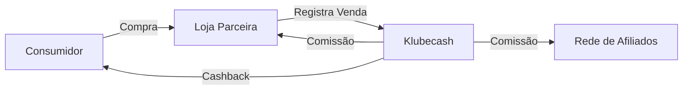

# 01 - Visão Geral do Sistema Klubecash

## 📋 Índice
- [Introdução](#introdução)
- [Modelo de Negócio](#modelo-de-negócio)
- [Principais Funcionalidades](#principais-funcionalidades)
- [Atores do Sistema](#atores-do-sistema)
- [Conceitos-Chave](#conceitos-chave)
- [Tecnologias Utilizadas](#tecnologias-utilizadas)

---

## 🎯 Introdução

A **Klubecash** é uma plataforma digital de cashback e gestão financeira que conecta consumidores e lojistas através de um sistema de recompensas e comissões distribuídas. O sistema permite que usuários realizem transações, acumulem cashback e que lojistas gerenciem suas vendas e comissões.

### Objetivo Principal
Criar um ecossistema financeiro onde:
- Consumidores ganham cashback em suas compras
- Lojistas aumentam suas vendas através de incentivos
- O sistema distribui comissões de forma automática e transparente

---

## 💼 Modelo de Negócio

### Como Funciona



### Fluxo de Valor

1. **Consumidor** realiza compra em loja parceira
2. **Lojista** registra a transação no sistema
3. **Klubecash** processa e distribui:
   - Cashback para o consumidor
   - Comissão para o lojista
   - Comissões para rede de indicação

---

## 🚀 Principais Funcionalidades

### 1. Gestão de Usuários e Carteiras

- **Cadastro de Usuários**
  - CPF único por usuário
  - Validação de email e telefone
  - Sistema de indicação (referral)

- **Carteiras Digitais**
  - Saldo em dinheiro (R$)
  - Histórico completo de transações
  - Múltiplas carteiras por usuário (pessoal, empresa, SEST SENAT)

### 2. Sistema de Lojas

- **Cadastro de Lojas**
  - Informações comerciais (CNPJ, endereço, contato)
  - Sistema de aprovação por administradores
  - Categorização de lojas

- **Gestão de Lojistas**
  - Dashboard de vendas
  - Relatórios de comissões
  - Gerenciamento de funcionários

### 3. Transações Financeiras

- **Tipos de Transação**
  - Depósitos (PIX, cartão de crédito)
  - Saques para conta bancária
  - Transferências entre usuários
  - Pagamentos de comissões
  - Estornos e ajustes

- **Processamento**
  - Registro em tempo real
  - Auditoria completa
  - Webhooks de notificação

### 4. Sistema de Assinaturas

- **Planos Disponíveis**
  - Plano Mensal
  - Plano Anual (com desconto)

- **Funcionalidades**
  - Renovação automática
  - Upgrade de plano com cálculo proporcional
  - Histórico de pagamentos
  - Notificações de vencimento

### 5. Comissões e Cashback

- **Distribuição Automática**
  - Cálculo baseado em regras de negócio
  - Comissões multinível
  - Cashback imediato

- **Transparência**
  - Histórico detalhado
  - Relatórios por período
  - Rastreamento completo

### 6. Integrações de Pagamento

- **Mercado Pago** (Principal)
  - PIX instantâneo
  - Cartão de crédito
  - Webhooks de confirmação

- **Abacate Pay**
  - PIX com QR Code
  - Confirmação automática

- **Stripe** (Teste)
  - Cartão de crédito internacional

- **OpenPix** (Configurado)
  - PIX com API simplificada

### 7. Sistema SEST SENAT

Funcionalidade específica para gestão de benefícios:
- Seleção de carteiras específicas
- Destinação de valores
- Integração com sistema externo

### 8. Comunicação

- **WhatsApp** (via WPPConnect)
  - Notificações de transações
  - Confirmações de pagamento
  - Alertas de sistema

- **Email** (SMTP)
  - Relatórios periódicos
  - Recuperação de senha
  - Comunicados

---

## 👥 Atores do Sistema

### 1. Administrador
**Papel**: Gestão completa da plataforma

**Permissões**:
- Aprovar/rejeitar lojas
- Gerenciar usuários
- Configurar comissões
- Acessar relatórios gerenciais
- Realizar ajustes financeiros

### 2. Lojista (Comerciante)
**Papel**: Proprietário de loja parceira

**Permissões**:
- Gerenciar loja
- Registrar vendas
- Visualizar relatórios
- Gerenciar funcionários
- Sacar comissões

### 3. Funcionário de Loja
**Papel**: Operador da loja

**Permissões**:
- Registrar vendas
- Visualizar histórico da loja
- Emitir recibos

### 4. Consumidor (Usuário Final)
**Papel**: Cliente que utiliza o sistema

**Permissões**:
- Realizar transações
- Visualizar saldo
- Sacar cashback
- Indicar amigos
- Gerenciar perfil

### 5. Sistema Automático
**Papel**: Processamento automatizado

**Responsabilidades**:
- Processar webhooks
- Calcular comissões
- Renovar assinaturas
- Enviar notificações
- Executar auditorias

---

## 🔑 Conceitos-Chave

### Carteira Digital (Wallet)
Representação do saldo financeiro do usuário. Cada usuário pode ter múltiplas carteiras:
- **Carteira Principal**: Uso geral
- **Carteira Empresa**: Para lojistas
- **Carteira SEST SENAT**: Benefícios específicos

### Transação
Qualquer movimentação financeira no sistema:
- **ID único** para rastreamento
- **Tipo** (depósito, saque, transferência, comissão)
- **Status** (pendente, confirmada, cancelada)
- **Metadados** completos para auditoria

### Comissão
Valor pago ao lojista ou rede de afiliados:
- **Percentual** configurável por loja
- **Distribuição** automática
- **Rastreamento** completo

### Assinatura (Subscription)
Pagamento recorrente para acesso à plataforma:
- **Planos** mensais ou anuais
- **Status** (ativa, cancelada, vencida)
- **Renovação** automática via API de pagamento

### Webhook
Notificação HTTP recebida de serviços externos:
- **Confirmação** de pagamentos
- **Atualização** de status
- **Processamento** assíncrono

---

## 🛠️ Tecnologias Utilizadas

### Backend
```
PHP 7.4+
├── Arquitetura MVC
├── PDO para banco de dados
├── JWT para autenticação
└── cURL para APIs externas
```

### Banco de Dados
```
MySQL 5.7+
├── 54 tabelas relacionais
├── Índices otimizados
├── Stored procedures
└── Triggers para auditoria
```

### Segurança
```
├── bcrypt para senhas
├── JWT para tokens
├── CSRF protection
├── SQL injection prevention
├── HTTPS obrigatório
└── Rate limiting
```

### Integrações
```
APIs Externas
├── Mercado Pago API v1
├── Stripe API v3
├── Abacate Pay API
├── OpenPix API
├── WPPConnect (WhatsApp)
└── SMTP (Email)
```

### Infraestrutura
```
Servidor Linux 4.4.0
├── Apache/Nginx
├── PHP-FPM
├── MySQL
└── SSL/TLS 1.2+
```

---

## 📊 Métricas e Indicadores

### Indicadores de Negócio
- **GMV** (Gross Merchandise Value): Volume total de transações
- **Take Rate**: Percentual de comissão por transação
- **CAC** (Customer Acquisition Cost): Custo de aquisição por usuário
- **LTV** (Lifetime Value): Valor médio por usuário

### Indicadores Técnicos
- **Uptime**: Disponibilidade do sistema
- **Response Time**: Tempo de resposta das APIs
- **Transaction Success Rate**: Taxa de sucesso das transações
- **Webhook Processing Time**: Tempo de processamento de webhooks

---

## 🎯 Roadmap e Melhorias Futuras

### Curto Prazo
- [ ] Implementar cache com Redis
- [ ] Adicionar testes unitários
- [ ] Documentação OpenAPI/Swagger
- [ ] Melhorar logging

### Médio Prazo
- [ ] Migrar para Laravel/Symfony
- [ ] Implementar message queue (RabbitMQ)
- [ ] Dashboard analítico avançado
- [ ] App mobile nativo

### Longo Prazo
- [ ] Microserviços
- [ ] Blockchain para auditoria
- [ ] IA para detecção de fraudes
- [ ] Expansão internacional

---

## 📚 Próximos Passos

Para entender mais sobre o sistema:
1. **[[02-arquitetura]]** - Entenda a estrutura técnica
2. **[[03-apis-endpoints]]** - Explore as APIs disponíveis
3. **[[07-fluxos-negocio]]** - Veja os fluxos principais

---

**Última atualização**: 2025-11-17
