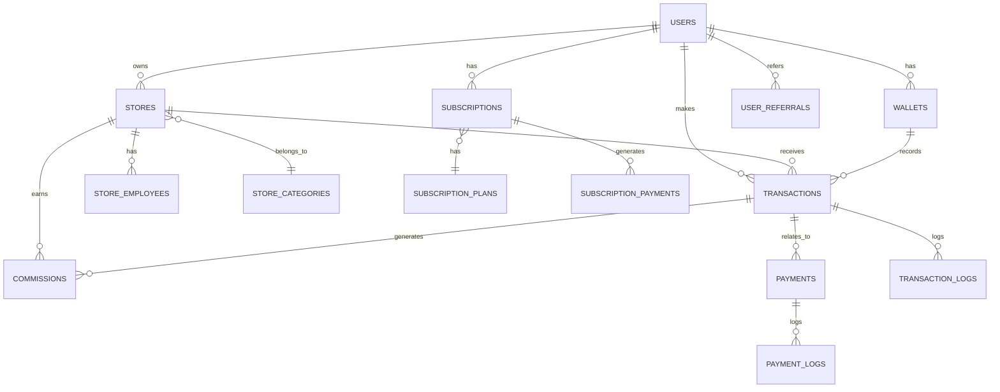

# 04 - Banco de Dados

## 📋 Índice
- [Visão Geral](#visão-geral)
- [Diagrama ER](#diagrama-er)
- [Tabelas Principais](#tabelas-principais)
- [Tabelas de Relacionamento](#tabelas-de-relacionamento)
- [Tabelas de Auditoria](#tabelas-de-auditoria)
- [Índices e Performance](#índices-e-performance)
- [Queries Comuns](#queries-comuns)

---

## 🗄️ Visão Geral

### Informações do Banco

- **Nome**: `klube_cash`
- **Engine**: InnoDB
- **Charset**: utf8mb4
- **Collation**: utf8mb4_unicode_ci
- **Total de Tabelas**: 54

### Categorias de Tabelas

```
Usuários e Autenticação (8 tabelas)
├── users
├── user_sessions
├── user_tokens
├── user_addresses
├── user_documents
├── user_preferences
├── password_resets
└── user_referrals

Lojas (6 tabelas)
├── stores
├── store_categories
├── store_addresses
├── store_documents
├── store_employees
└── store_settings

Financeiro (12 tabelas)
├── wallets
├── transactions
├── transaction_details
├── commissions
├── commission_rules
├── payments
├── payment_methods
├── subscriptions
├── subscription_plans
├── subscription_payments
├── withdrawals
└── refunds

Auditoria e Logs (8 tabelas)
├── audit_logs
├── transaction_logs
├── payment_logs
├── webhook_logs
├── error_logs
├── access_logs
├── notification_logs
└── system_logs

Notificações (4 tabelas)
├── notifications
├── notification_templates
├── email_queue
└── whatsapp_queue

SEST SENAT (3 tabelas)
├── senat_carteiras
├── senat_selections
└── senat_transactions

Configurações (5 tabelas)
├── settings
├── system_config
├── api_keys
├── feature_flags
└── maintenance_mode

Outros (8 tabelas)
├── files
├── file_uploads
├── sessions
├── cache
├── jobs
├── failed_jobs
├── migrations
└── password_reset_tokens
```

---

## 🗺️ Diagrama ER (Entidade-Relacionamento)

### Relacionamentos Principais



---

## 📊 Tabelas Principais

### 1. users

Tabela principal de usuários do sistema.

```sql
CREATE TABLE users (
    id BIGINT UNSIGNED AUTO_INCREMENT PRIMARY KEY,
    name VARCHAR(255) NOT NULL,
    email VARCHAR(255) UNIQUE NOT NULL,
    cpf VARCHAR(14) UNIQUE NOT NULL,
    phone VARCHAR(20),
    password VARCHAR(255) NOT NULL,
    type ENUM('user', 'merchant', 'admin') DEFAULT 'user',
    status ENUM('active', 'inactive', 'blocked', 'pending') DEFAULT 'pending',
    email_verified_at TIMESTAMP NULL,
    phone_verified_at TIMESTAMP NULL,
    referral_code VARCHAR(20) UNIQUE,
    referred_by BIGINT UNSIGNED NULL,
    avatar VARCHAR(255) NULL,
    birth_date DATE NULL,
    created_at TIMESTAMP DEFAULT CURRENT_TIMESTAMP,
    updated_at TIMESTAMP DEFAULT CURRENT_TIMESTAMP ON UPDATE CURRENT_TIMESTAMP,
    deleted_at TIMESTAMP NULL,

    INDEX idx_email (email),
    INDEX idx_cpf (cpf),
    INDEX idx_referral_code (referral_code),
    INDEX idx_status (status),
    INDEX idx_type (type),
    FOREIGN KEY (referred_by) REFERENCES users(id) ON DELETE SET NULL
) ENGINE=InnoDB DEFAULT CHARSET=utf8mb4 COLLATE=utf8mb4_unicode_ci;
```

**Descrição**: Armazena dados de todos os usuários (consumidores, lojistas, admins)

**Campos Importantes**:
- `type`: Define o papel do usuário
- `status`: Controla acesso ao sistema
- `referral_code`: Código único para indicação
- `referred_by`: Quem indicou este usuário

---

### 2. wallets

Carteiras digitais dos usuários.

```sql
CREATE TABLE wallets (
    id BIGINT UNSIGNED AUTO_INCREMENT PRIMARY KEY,
    user_id BIGINT UNSIGNED NOT NULL,
    type ENUM('personal', 'business', 'senat') DEFAULT 'personal',
    balance DECIMAL(15, 2) DEFAULT 0.00,
    blocked_balance DECIMAL(15, 2) DEFAULT 0.00,
    currency VARCHAR(3) DEFAULT 'BRL',
    status ENUM('active', 'inactive', 'blocked') DEFAULT 'active',
    created_at TIMESTAMP DEFAULT CURRENT_TIMESTAMP,
    updated_at TIMESTAMP DEFAULT CURRENT_TIMESTAMP ON UPDATE CURRENT_TIMESTAMP,

    INDEX idx_user_id (user_id),
    INDEX idx_type (type),
    INDEX idx_status (status),
    FOREIGN KEY (user_id) REFERENCES users(id) ON DELETE CASCADE
) ENGINE=InnoDB DEFAULT CHARSET=utf8mb4 COLLATE=utf8mb4_unicode_ci;
```

**Descrição**: Gerencia saldos financeiros dos usuários

**Campos Importantes**:
- `balance`: Saldo disponível
- `blocked_balance`: Saldo bloqueado temporariamente
- `type`: Tipo de carteira (pessoal, empresa, SENAT)

---

### 3. transactions

Registro de todas as transações financeiras.

```sql
CREATE TABLE transactions (
    id BIGINT UNSIGNED AUTO_INCREMENT PRIMARY KEY,
    transaction_id VARCHAR(50) UNIQUE NOT NULL,
    user_id BIGINT UNSIGNED NOT NULL,
    wallet_id BIGINT UNSIGNED NOT NULL,
    type ENUM('deposit', 'withdrawal', 'transfer', 'commission', 'refund', 'cashback') NOT NULL,
    amount DECIMAL(15, 2) NOT NULL,
    fee DECIMAL(15, 2) DEFAULT 0.00,
    net_amount DECIMAL(15, 2) NOT NULL,
    currency VARCHAR(3) DEFAULT 'BRL',
    status ENUM('pending', 'processing', 'completed', 'failed', 'cancelled') DEFAULT 'pending',
    description TEXT,
    from_wallet_id BIGINT UNSIGNED NULL,
    to_wallet_id BIGINT UNSIGNED NULL,
    payment_id BIGINT UNSIGNED NULL,
    metadata JSON,
    processed_at TIMESTAMP NULL,
    created_at TIMESTAMP DEFAULT CURRENT_TIMESTAMP,
    updated_at TIMESTAMP DEFAULT CURRENT_TIMESTAMP ON UPDATE CURRENT_TIMESTAMP,

    INDEX idx_transaction_id (transaction_id),
    INDEX idx_user_id (user_id),
    INDEX idx_wallet_id (wallet_id),
    INDEX idx_type (type),
    INDEX idx_status (status),
    INDEX idx_created_at (created_at),
    FOREIGN KEY (user_id) REFERENCES users(id) ON DELETE CASCADE,
    FOREIGN KEY (wallet_id) REFERENCES wallets(id) ON DELETE CASCADE,
    FOREIGN KEY (from_wallet_id) REFERENCES wallets(id) ON DELETE SET NULL,
    FOREIGN KEY (to_wallet_id) REFERENCES wallets(id) ON DELETE SET NULL
) ENGINE=InnoDB DEFAULT CHARSET=utf8mb4 COLLATE=utf8mb4_unicode_ci;
```

**Descrição**: Registra todas as movimentações financeiras

**Campos Importantes**:
- `transaction_id`: ID único para rastreamento
- `type`: Tipo de transação
- `amount`: Valor bruto
- `net_amount`: Valor líquido após taxas
- `metadata`: Dados adicionais em JSON

---

### 4. stores

Lojas parceiras cadastradas.

```sql
CREATE TABLE stores (
    id BIGINT UNSIGNED AUTO_INCREMENT PRIMARY KEY,
    owner_id BIGINT UNSIGNED NOT NULL,
    name VARCHAR(255) NOT NULL,
    trade_name VARCHAR(255) NOT NULL,
    cnpj VARCHAR(18) UNIQUE NOT NULL,
    email VARCHAR(255) NOT NULL,
    phone VARCHAR(20) NOT NULL,
    category_id BIGINT UNSIGNED NOT NULL,
    status ENUM('pending', 'approved', 'rejected', 'blocked') DEFAULT 'pending',
    commission_rate DECIMAL(5, 2) DEFAULT 0.00,
    logo VARCHAR(255) NULL,
    description TEXT,
    website VARCHAR(255),
    approval_notes TEXT,
    approved_by BIGINT UNSIGNED NULL,
    approved_at TIMESTAMP NULL,
    created_at TIMESTAMP DEFAULT CURRENT_TIMESTAMP,
    updated_at TIMESTAMP DEFAULT CURRENT_TIMESTAMP ON UPDATE CURRENT_TIMESTAMP,
    deleted_at TIMESTAMP NULL,

    INDEX idx_owner_id (owner_id),
    INDEX idx_cnpj (cnpj),
    INDEX idx_category_id (category_id),
    INDEX idx_status (status),
    FOREIGN KEY (owner_id) REFERENCES users(id) ON DELETE CASCADE,
    FOREIGN KEY (category_id) REFERENCES store_categories(id),
    FOREIGN KEY (approved_by) REFERENCES users(id) ON DELETE SET NULL
) ENGINE=InnoDB DEFAULT CHARSET=utf8mb4 COLLATE=utf8mb4_unicode_ci;
```

**Descrição**: Gerencia lojas parceiras

**Campos Importantes**:
- `status`: Controla aprovação e acesso
- `commission_rate`: Taxa de comissão da loja
- `approved_by`: Admin que aprovou

---

### 5. commissions

Comissões geradas por transações.

```sql
CREATE TABLE commissions (
    id BIGINT UNSIGNED AUTO_INCREMENT PRIMARY KEY,
    transaction_id BIGINT UNSIGNED NOT NULL,
    user_id BIGINT UNSIGNED NOT NULL,
    wallet_id BIGINT UNSIGNED NOT NULL,
    store_id BIGINT UNSIGNED NULL,
    type ENUM('sale', 'referral', 'cashback') NOT NULL,
    amount DECIMAL(15, 2) NOT NULL,
    rate DECIMAL(5, 2) NOT NULL,
    level INT DEFAULT 1,
    status ENUM('pending', 'paid', 'cancelled') DEFAULT 'pending',
    paid_at TIMESTAMP NULL,
    created_at TIMESTAMP DEFAULT CURRENT_TIMESTAMP,
    updated_at TIMESTAMP DEFAULT CURRENT_TIMESTAMP ON UPDATE CURRENT_TIMESTAMP,

    INDEX idx_transaction_id (transaction_id),
    INDEX idx_user_id (user_id),
    INDEX idx_store_id (store_id),
    INDEX idx_type (type),
    INDEX idx_status (status),
    FOREIGN KEY (transaction_id) REFERENCES transactions(id) ON DELETE CASCADE,
    FOREIGN KEY (user_id) REFERENCES users(id) ON DELETE CASCADE,
    FOREIGN KEY (wallet_id) REFERENCES wallets(id) ON DELETE CASCADE,
    FOREIGN KEY (store_id) REFERENCES stores(id) ON DELETE SET NULL
) ENGINE=InnoDB DEFAULT CHARSET=utf8mb4 COLLATE=utf8mb4_unicode_ci;
```

**Descrição**: Registra comissões distribuídas

**Campos Importantes**:
- `type`: Tipo de comissão (venda, indicação, cashback)
- `rate`: Percentual aplicado
- `level`: Nível na rede de indicação

---

### 6. payments

Pagamentos realizados via gateways externos.

```sql
CREATE TABLE payments (
    id BIGINT UNSIGNED AUTO_INCREMENT PRIMARY KEY,
    payment_id VARCHAR(100) UNIQUE NOT NULL,
    user_id BIGINT UNSIGNED NOT NULL,
    transaction_id BIGINT UNSIGNED NULL,
    provider ENUM('mercadopago', 'stripe', 'abacatepay', 'openpix') NOT NULL,
    method ENUM('pix', 'credit_card', 'debit_card', 'boleto') NOT NULL,
    amount DECIMAL(15, 2) NOT NULL,
    fee DECIMAL(15, 2) DEFAULT 0.00,
    net_amount DECIMAL(15, 2) NOT NULL,
    status ENUM('pending', 'processing', 'approved', 'rejected', 'cancelled', 'refunded') DEFAULT 'pending',
    external_id VARCHAR(255),
    external_status VARCHAR(50),
    pix_qr_code TEXT,
    pix_qr_code_base64 TEXT,
    card_last_digits VARCHAR(4),
    installments INT DEFAULT 1,
    metadata JSON,
    expires_at TIMESTAMP NULL,
    approved_at TIMESTAMP NULL,
    rejected_at TIMESTAMP NULL,
    created_at TIMESTAMP DEFAULT CURRENT_TIMESTAMP,
    updated_at TIMESTAMP DEFAULT CURRENT_TIMESTAMP ON UPDATE CURRENT_TIMESTAMP,

    INDEX idx_payment_id (payment_id),
    INDEX idx_user_id (user_id),
    INDEX idx_transaction_id (transaction_id),
    INDEX idx_provider (provider),
    INDEX idx_status (status),
    INDEX idx_external_id (external_id),
    FOREIGN KEY (user_id) REFERENCES users(id) ON DELETE CASCADE,
    FOREIGN KEY (transaction_id) REFERENCES transactions(id) ON DELETE SET NULL
) ENGINE=InnoDB DEFAULT CHARSET=utf8mb4 COLLATE=utf8mb4_unicode_ci;
```

**Descrição**: Gerencia pagamentos via provedores externos

**Campos Importantes**:
- `provider`: Gateway de pagamento utilizado
- `external_id`: ID do pagamento no provedor
- `pix_qr_code`: QR Code para pagamento PIX

---

### 7. subscriptions

Assinaturas de usuários.

```sql
CREATE TABLE subscriptions (
    id BIGINT UNSIGNED AUTO_INCREMENT PRIMARY KEY,
    user_id BIGINT UNSIGNED NOT NULL,
    plan_id BIGINT UNSIGNED NOT NULL,
    status ENUM('active', 'cancelled', 'expired', 'pending') DEFAULT 'pending',
    amount DECIMAL(15, 2) NOT NULL,
    billing_cycle ENUM('monthly', 'annual') NOT NULL,
    next_billing_date DATE NOT NULL,
    started_at TIMESTAMP NULL,
    cancelled_at TIMESTAMP NULL,
    expires_at TIMESTAMP NULL,
    cancellation_reason TEXT,
    created_at TIMESTAMP DEFAULT CURRENT_TIMESTAMP,
    updated_at TIMESTAMP DEFAULT CURRENT_TIMESTAMP ON UPDATE CURRENT_TIMESTAMP,

    INDEX idx_user_id (user_id),
    INDEX idx_plan_id (plan_id),
    INDEX idx_status (status),
    INDEX idx_next_billing_date (next_billing_date),
    FOREIGN KEY (user_id) REFERENCES users(id) ON DELETE CASCADE,
    FOREIGN KEY (plan_id) REFERENCES subscription_plans(id)
) ENGINE=InnoDB DEFAULT CHARSET=utf8mb4 COLLATE=utf8mb4_unicode_ci;
```

**Descrição**: Gerencia assinaturas de planos

**Campos Importantes**:
- `billing_cycle`: Ciclo de cobrança
- `next_billing_date`: Próxima cobrança
- `status`: Estado da assinatura

---

### 8. subscription_plans

Planos de assinatura disponíveis.

```sql
CREATE TABLE subscription_plans (
    id BIGINT UNSIGNED AUTO_INCREMENT PRIMARY KEY,
    name VARCHAR(255) NOT NULL,
    description TEXT,
    price DECIMAL(15, 2) NOT NULL,
    billing_cycle ENUM('monthly', 'annual') NOT NULL,
    features JSON,
    status ENUM('active', 'inactive') DEFAULT 'active',
    created_at TIMESTAMP DEFAULT CURRENT_TIMESTAMP,
    updated_at TIMESTAMP DEFAULT CURRENT_TIMESTAMP ON UPDATE CURRENT_TIMESTAMP,

    INDEX idx_status (status),
    INDEX idx_billing_cycle (billing_cycle)
) ENGINE=InnoDB DEFAULT CHARSET=utf8mb4 COLLATE=utf8mb4_unicode_ci;
```

**Descrição**: Define planos de assinatura

---

### 9. store_employees

Funcionários de lojas.

```sql
CREATE TABLE store_employees (
    id BIGINT UNSIGNED AUTO_INCREMENT PRIMARY KEY,
    store_id BIGINT UNSIGNED NOT NULL,
    user_id BIGINT UNSIGNED NOT NULL,
    role ENUM('vendedor', 'gerente', 'admin') DEFAULT 'vendedor',
    permissions JSON,
    status ENUM('active', 'inactive') DEFAULT 'active',
    hired_at DATE,
    fired_at DATE NULL,
    created_at TIMESTAMP DEFAULT CURRENT_TIMESTAMP,
    updated_at TIMESTAMP DEFAULT CURRENT_TIMESTAMP ON UPDATE CURRENT_TIMESTAMP,

    INDEX idx_store_id (store_id),
    INDEX idx_user_id (user_id),
    INDEX idx_status (status),
    UNIQUE KEY unique_store_user (store_id, user_id),
    FOREIGN KEY (store_id) REFERENCES stores(id) ON DELETE CASCADE,
    FOREIGN KEY (user_id) REFERENCES users(id) ON DELETE CASCADE
) ENGINE=InnoDB DEFAULT CHARSET=utf8mb4 COLLATE=utf8mb4_unicode_ci;
```

**Descrição**: Relaciona funcionários com lojas

---

### 10. senat_carteiras

Carteiras específicas do sistema SEST SENAT.

```sql
CREATE TABLE senat_carteiras (
    id BIGINT UNSIGNED AUTO_INCREMENT PRIMARY KEY,
    name VARCHAR(255) NOT NULL,
    code VARCHAR(50) UNIQUE NOT NULL,
    description TEXT,
    status ENUM('active', 'inactive') DEFAULT 'active',
    created_at TIMESTAMP DEFAULT CURRENT_TIMESTAMP,
    updated_at TIMESTAMP DEFAULT CURRENT_TIMESTAMP ON UPDATE CURRENT_TIMESTAMP,

    INDEX idx_code (code),
    INDEX idx_status (status)
) ENGINE=InnoDB DEFAULT CHARSET=utf8mb4 COLLATE=utf8mb4_unicode_ci;
```

**Descrição**: Carteiras do sistema SEST SENAT

---

## 📋 Tabelas de Relacionamento

### user_referrals

```sql
CREATE TABLE user_referrals (
    id BIGINT UNSIGNED AUTO_INCREMENT PRIMARY KEY,
    referrer_id BIGINT UNSIGNED NOT NULL,
    referred_id BIGINT UNSIGNED NOT NULL,
    status ENUM('pending', 'active', 'cancelled') DEFAULT 'pending',
    created_at TIMESTAMP DEFAULT CURRENT_TIMESTAMP,

    FOREIGN KEY (referrer_id) REFERENCES users(id) ON DELETE CASCADE,
    FOREIGN KEY (referred_id) REFERENCES users(id) ON DELETE CASCADE,
    UNIQUE KEY unique_referral (referrer_id, referred_id)
) ENGINE=InnoDB;
```

---

## 🔍 Tabelas de Auditoria

### audit_logs

```sql
CREATE TABLE audit_logs (
    id BIGINT UNSIGNED AUTO_INCREMENT PRIMARY KEY,
    user_id BIGINT UNSIGNED NULL,
    action VARCHAR(255) NOT NULL,
    table_name VARCHAR(100),
    record_id BIGINT UNSIGNED NULL,
    old_values JSON,
    new_values JSON,
    ip_address VARCHAR(45),
    user_agent TEXT,
    created_at TIMESTAMP DEFAULT CURRENT_TIMESTAMP,

    INDEX idx_user_id (user_id),
    INDEX idx_action (action),
    INDEX idx_table_name (table_name),
    INDEX idx_created_at (created_at),
    FOREIGN KEY (user_id) REFERENCES users(id) ON DELETE SET NULL
) ENGINE=InnoDB;
```

**Descrição**: Registra todas as ações importantes no sistema

---

### webhook_logs

```sql
CREATE TABLE webhook_logs (
    id BIGINT UNSIGNED AUTO_INCREMENT PRIMARY KEY,
    provider VARCHAR(50) NOT NULL,
    event_type VARCHAR(100) NOT NULL,
    payload JSON NOT NULL,
    headers JSON,
    response TEXT,
    status ENUM('received', 'processing', 'processed', 'failed') DEFAULT 'received',
    processed_at TIMESTAMP NULL,
    created_at TIMESTAMP DEFAULT CURRENT_TIMESTAMP,

    INDEX idx_provider (provider),
    INDEX idx_event_type (event_type),
    INDEX idx_status (status),
    INDEX idx_created_at (created_at)
) ENGINE=InnoDB;
```

**Descrição**: Registra webhooks recebidos

---

## ⚡ Índices e Performance

### Índices Principais

```sql
-- Buscas frequentes por usuário
CREATE INDEX idx_users_email ON users(email);
CREATE INDEX idx_users_cpf ON users(cpf);

-- Transações por período
CREATE INDEX idx_transactions_date ON transactions(created_at, status);

-- Pagamentos pendentes
CREATE INDEX idx_payments_status_date ON payments(status, created_at);

-- Comissões a pagar
CREATE INDEX idx_commissions_unpaid ON commissions(status, user_id) WHERE status = 'pending';

-- Assinaturas a renovar
CREATE INDEX idx_subscriptions_renewal ON subscriptions(next_billing_date, status) WHERE status = 'active';
```

### Otimizações

1. **Particionamento**: Tabelas de logs particionadas por mês
2. **Archive**: Transações antigas movidas para tabelas de arquivo
3. **Cache**: Queries frequentes em Redis
4. **Read Replicas**: Leituras distribuídas

---

## 🔧 Queries Comuns

### Saldo Total de um Usuário

```sql
SELECT SUM(balance) as total_balance
FROM wallets
WHERE user_id = ? AND status = 'active';
```

### Transações do Mês

```sql
SELECT *
FROM transactions
WHERE user_id = ?
  AND DATE_FORMAT(created_at, '%Y-%m') = DATE_FORMAT(NOW(), '%Y-%m')
  AND status = 'completed'
ORDER BY created_at DESC;
```

### Comissões Pendentes de Pagamento

```sql
SELECT
    c.*,
    u.name as user_name,
    u.email as user_email,
    SUM(c.amount) as total_commission
FROM commissions c
JOIN users u ON c.user_id = u.id
WHERE c.status = 'pending'
GROUP BY c.user_id
HAVING total_commission >= 10.00;  -- Mínimo para saque
```

### Top Lojas por Volume

```sql
SELECT
    s.id,
    s.name,
    COUNT(t.id) as total_transactions,
    SUM(t.amount) as total_volume
FROM stores s
JOIN transactions t ON t.store_id = s.id
WHERE t.status = 'completed'
  AND t.created_at >= DATE_SUB(NOW(), INTERVAL 30 DAY)
GROUP BY s.id
ORDER BY total_volume DESC
LIMIT 10;
```

### Assinaturas a Renovar Hoje

```sql
SELECT
    s.*,
    u.name as user_name,
    u.email as user_email,
    sp.name as plan_name
FROM subscriptions s
JOIN users u ON s.user_id = u.id
JOIN subscription_plans sp ON s.plan_id = sp.id
WHERE s.status = 'active'
  AND DATE(s.next_billing_date) = CURDATE();
```

---

## 🔐 Segurança

### Criptografia

- **Senhas**: bcrypt (10 rounds)
- **Tokens**: Hash SHA-256
- **Dados Sensíveis**: AES-256 encryption

### Backup

```bash
# Backup diário
mysqldump klube_cash > backup_$(date +%Y%m%d).sql

# Backup incremental
mysqlbinlog --start-datetime="2025-11-17 00:00:00" \
            --stop-datetime="2025-11-17 23:59:59"
```

### Replicação

```
Master (Produção)
    ↓
Slave 1 (Leituras)
    ↓
Slave 2 (Backup)
```

---

## 📚 Próximos Passos

- **[[05-integracoes]]** - Entenda as integrações externas
- **[[06-autenticacao-seguranca]]** - Veja detalhes de segurança
- **[[08-guia-desenvolvimento]]** - Comece a desenvolver

---

**Última atualização**: 2025-11-17
