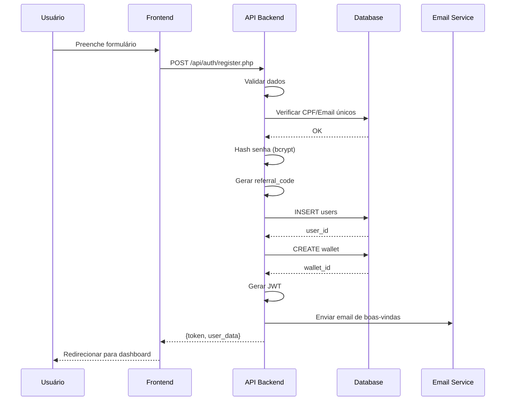
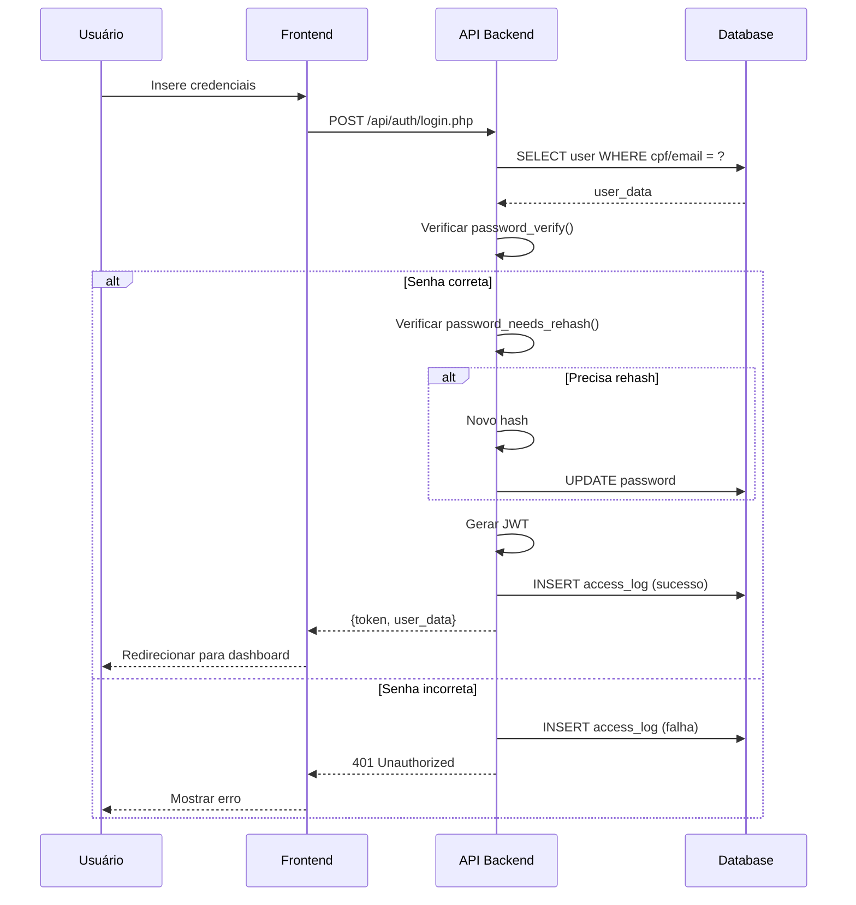
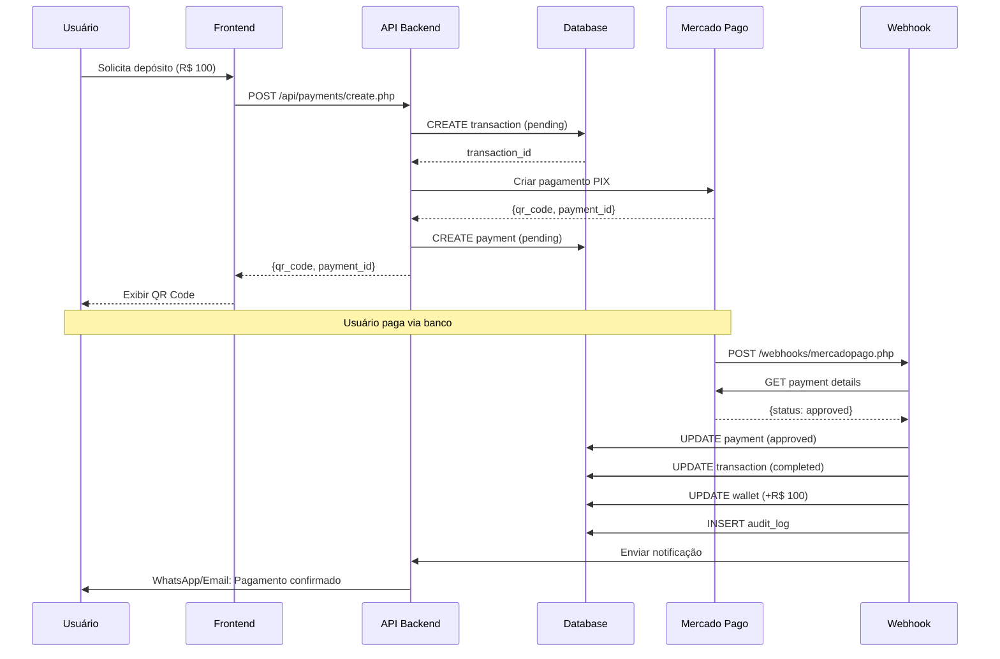
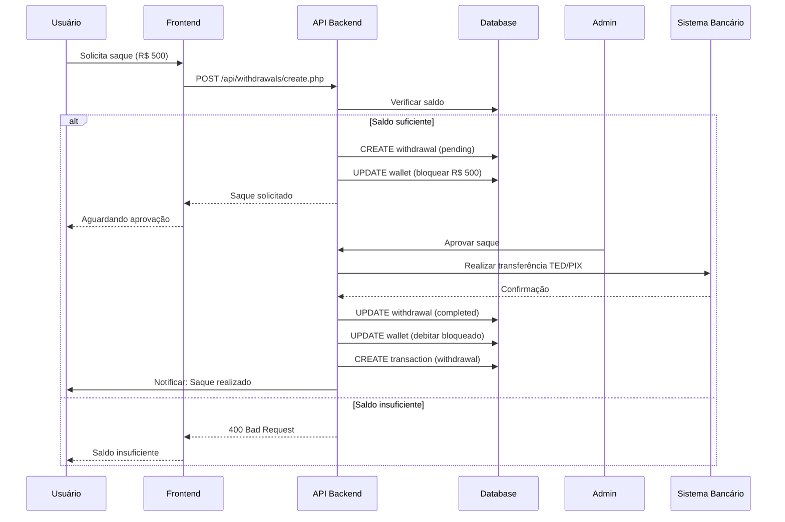
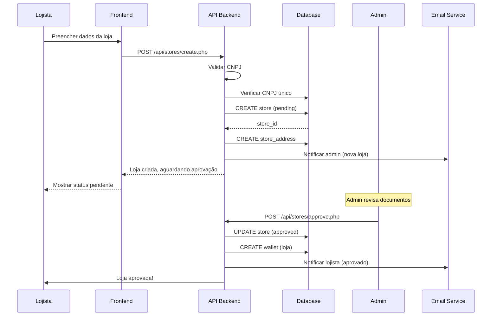
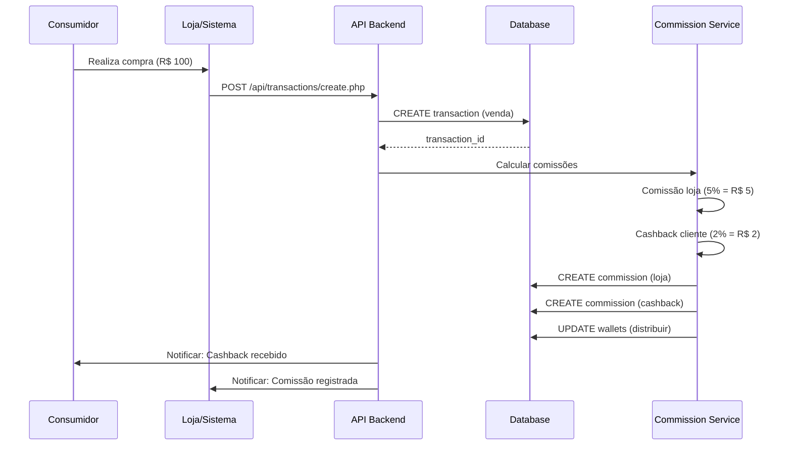
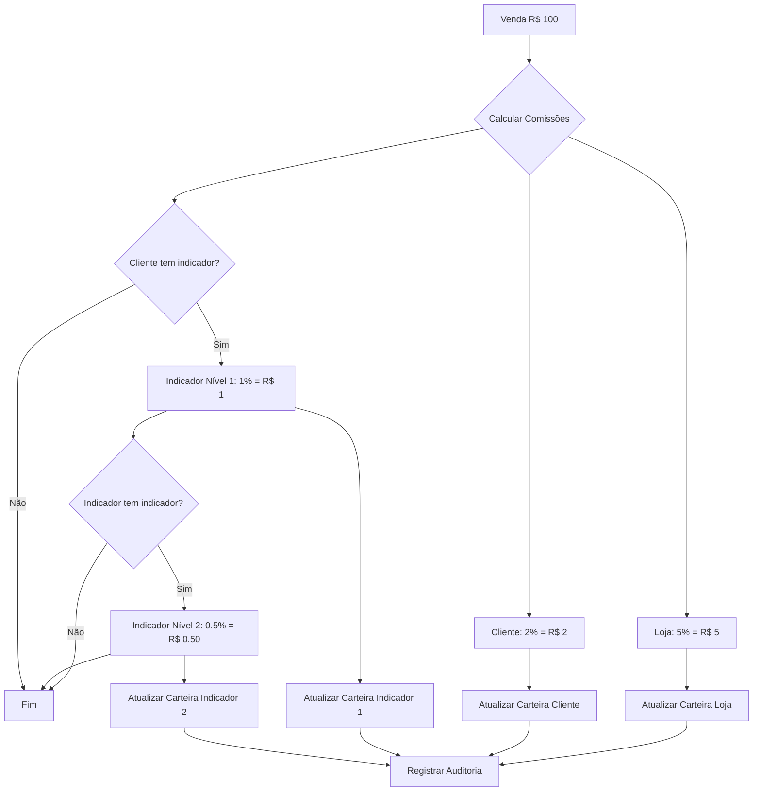
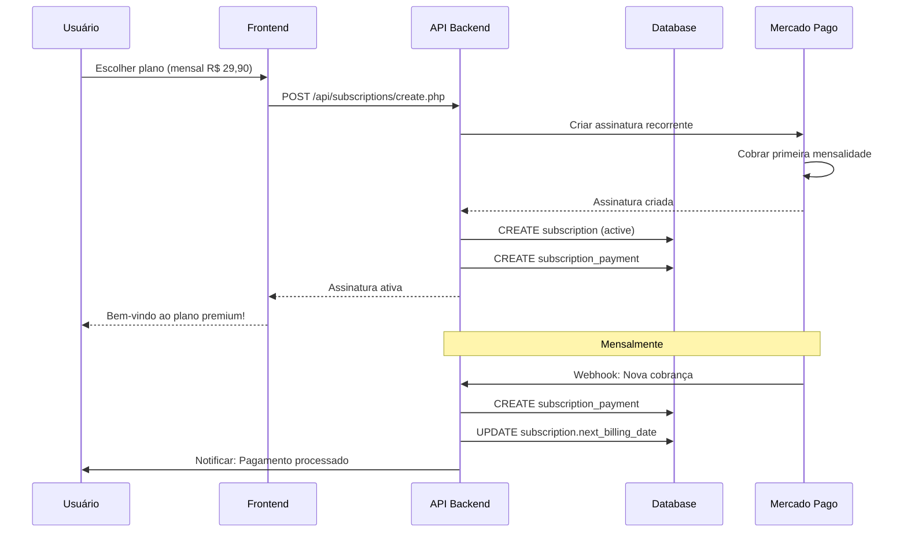
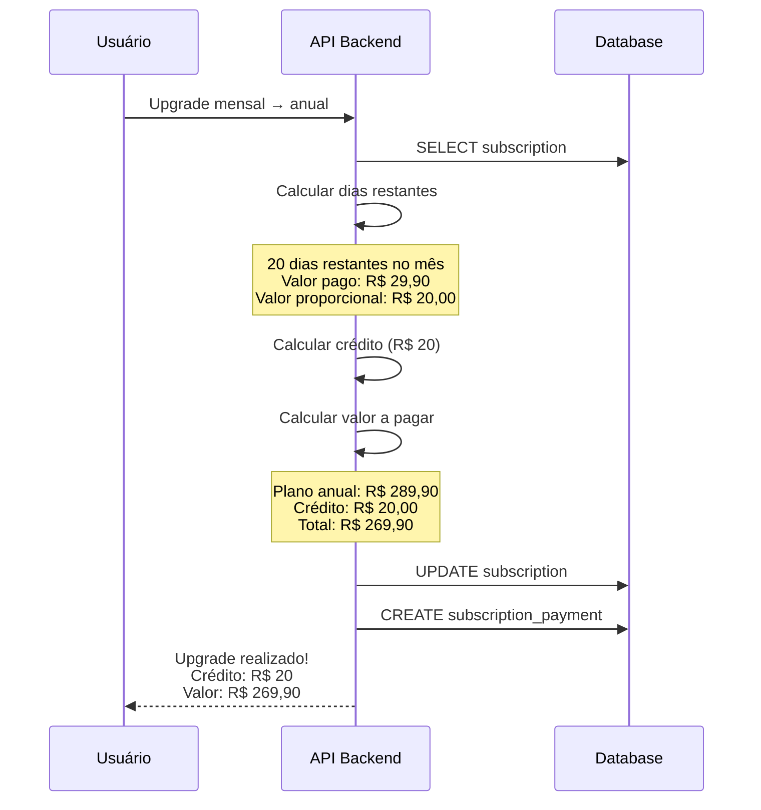
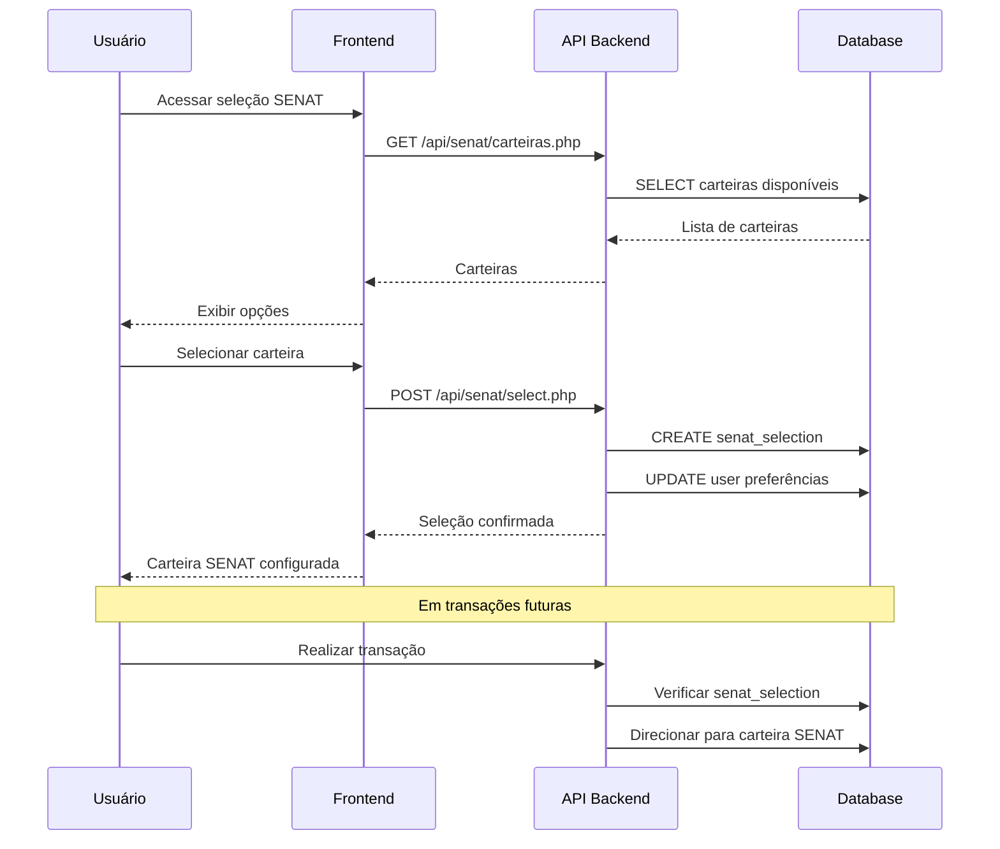

# 07 - Fluxos de Negócio

## 📋 Índice
- [Cadastro e Autenticação](#cadastro-e-autenticação)
- [Transações Financeiras](#transações-financeiras)
- [Gestão de Lojas](#gestão-de-lojas)
- [Sistema de Comissões](#sistema-de-comissões)
- [Assinaturas](#assinaturas)
- [Sistema SEST SENAT](#sistema-sest-senat)

---

## 👤 Cadastro e Autenticação

### Fluxo: Cadastro de Novo Usuário



#### Código Simplificado

```php
// api/auth/register.php
function register($data) {
    // 1. Validar dados
    if (!Validator::email($data['email'])) {
        throw new Exception('Email inválido');
    }
    if (!Validator::cpf($data['cpf'])) {
        throw new Exception('CPF inválido');
    }

    // 2. Verificar unicidade
    if (userExists($data['cpf'], $data['email'])) {
        throw new Exception('CPF ou email já cadastrado');
    }

    // 3. Hash senha
    $passwordHash = password_hash($data['password'], PASSWORD_BCRYPT);

    // 4. Gerar código de indicação
    $referralCode = generateReferralCode();

    // 5. Criar usuário
    $userId = createUser([
        'name' => $data['name'],
        'email' => $data['email'],
        'cpf' => $data['cpf'],
        'phone' => $data['phone'],
        'password' => $passwordHash,
        'referral_code' => $referralCode,
        'referred_by' => $data['referral_code'] ?? null
    ]);

    // 6. Criar carteira
    createWallet($userId, 'personal');

    // 7. Processar indicação
    if (!empty($data['referral_code'])) {
        processReferral($data['referral_code'], $userId);
    }

    // 8. Enviar email
    sendWelcomeEmail($data['email'], $data['name']);

    // 9. Gerar token
    $token = generateJWT($userId, $data['email'], 'user');

    return [
        'user_id' => $userId,
        'token' => $token
    ];
}
```

---

### Fluxo: Login



---

## 💰 Transações Financeiras

### Fluxo: Depósito via PIX



#### Código Simplificado

```php
// api/payments/create.php
function createPixPayment($userId, $amount) {
    // 1. Criar transação
    $transactionId = createTransaction([
        'user_id' => $userId,
        'type' => 'deposit',
        'amount' => $amount,
        'status' => 'pending'
    ]);

    // 2. Chamar Mercado Pago
    $mercadoPago = new MercadoPagoService();
    $payment = $mercadoPago->createPixPayment([
        'transaction_amount' => $amount,
        'external_reference' => $transactionId,
        'payer' => getUserPayerInfo($userId)
    ]);

    // 3. Salvar pagamento
    createPayment([
        'payment_id' => uniqid('PAY_'),
        'user_id' => $userId,
        'transaction_id' => $transactionId,
        'provider' => 'mercadopago',
        'method' => 'pix',
        'amount' => $amount,
        'external_id' => $payment['id'],
        'pix_qr_code' => $payment['point_of_interaction']['transaction_data']['qr_code'],
        'status' => 'pending',
        'expires_at' => date('Y-m-d H:i:s', strtotime('+1 hour'))
    ]);

    return [
        'transaction_id' => $transactionId,
        'qr_code' => $payment['point_of_interaction']['transaction_data']['qr_code'],
        'qr_code_base64' => $payment['point_of_interaction']['transaction_data']['qr_code_base64']
    ];
}

// webhooks/mercadopago.php
function processWebhook($data) {
    // 1. Buscar pagamento no Mercado Pago
    $mercadoPago = new MercadoPagoService();
    $payment = $mercadoPago->getPayment($data['data']['id']);

    // 2. Buscar transação local
    $transactionId = $payment['external_reference'];
    $transaction = getTransaction($transactionId);

    // 3. Verificar se já foi processado
    if ($transaction['status'] === 'completed') {
        return; // Já processado
    }

    // 4. Processar conforme status
    if ($payment['status'] === 'approved') {
        DB::beginTransaction();
        try {
            // Atualizar pagamento
            updatePayment($transaction['payment_id'], [
                'status' => 'approved',
                'approved_at' => date('Y-m-d H:i:s')
            ]);

            // Atualizar transação
            updateTransaction($transactionId, [
                'status' => 'completed',
                'processed_at' => date('Y-m-d H:i:s')
            ]);

            // Atualizar saldo da carteira
            updateWalletBalance(
                $transaction['wallet_id'],
                $transaction['amount']
            );

            // Auditoria
            createAuditLog([
                'action' => 'payment_confirmed',
                'user_id' => $transaction['user_id'],
                'details' => ['transaction_id' => $transactionId]
            ]);

            DB::commit();

            // Notificar usuário
            notifyPaymentConfirmed($transaction['user_id'], $transaction['amount']);
        } catch (Exception $e) {
            DB::rollback();
            throw $e;
        }
    }
}
```

---

### Fluxo: Saque



---

## 🏪 Gestão de Lojas

### Fluxo: Cadastro de Loja



#### Código Simplificado

```php
// api/stores/create.php
function createStore($ownerId, $data) {
    // 1. Validar CNPJ
    if (!Validator::cnpj($data['cnpj'])) {
        throw new Exception('CNPJ inválido');
    }

    // 2. Verificar se CNPJ já existe
    if (storeExists($data['cnpj'])) {
        throw new Exception('CNPJ já cadastrado');
    }

    DB::beginTransaction();
    try {
        // 3. Criar loja
        $storeId = createStoreRecord([
            'owner_id' => $ownerId,
            'name' => $data['name'],
            'trade_name' => $data['trade_name'],
            'cnpj' => $data['cnpj'],
            'email' => $data['email'],
            'phone' => $data['phone'],
            'category_id' => $data['category_id'],
            'commission_rate' => $data['commission_rate'] ?? 5.0,
            'status' => 'pending'
        ]);

        // 4. Criar endereço
        createStoreAddress($storeId, $data['address']);

        // 5. Upload de documentos (se houver)
        if (!empty($data['documents'])) {
            uploadStoreDocuments($storeId, $data['documents']);
        }

        DB::commit();

        // 6. Notificar admin
        notifyAdminNewStore($storeId);

        return ['store_id' => $storeId, 'status' => 'pending'];
    } catch (Exception $e) {
        DB::rollback();
        throw $e;
    }
}

// api/stores/approve.php (admin apenas)
function approveStore($adminId, $storeId, $approved, $notes = '') {
    $store = getStore($storeId);

    if ($store['status'] !== 'pending') {
        throw new Exception('Loja já foi processada');
    }

    DB::beginTransaction();
    try {
        if ($approved) {
            // Aprovar loja
            updateStore($storeId, [
                'status' => 'approved',
                'approved_by' => $adminId,
                'approved_at' => date('Y-m-d H:i:s'),
                'approval_notes' => $notes
            ]);

            // Criar carteira para a loja
            createWallet($store['owner_id'], 'business', $storeId);

            // Notificar lojista
            notifyStoreApproved($store['owner_id'], $storeId);
        } else {
            // Rejeitar loja
            updateStore($storeId, [
                'status' => 'rejected',
                'approved_by' => $adminId,
                'approval_notes' => $notes
            ]);

            // Notificar lojista
            notifyStoreRejected($store['owner_id'], $storeId, $notes);
        }

        DB::commit();
    } catch (Exception $e) {
        DB::rollback();
        throw $e;
    }
}
```

---

### Fluxo: Registro de Venda



---

## 💵 Sistema de Comissões

### Fluxo: Distribuição de Comissões



#### Código Simplificado

```php
// services/CommissionService.php
class CommissionService {
    public function distributeCommissions($transactionId) {
        $transaction = $this->getTransaction($transactionId);
        $store = $this->getStore($transaction['store_id']);

        $commissions = [];

        // 1. Comissão da loja
        $storeCommission = $transaction['amount'] * ($store['commission_rate'] / 100);
        $commissions[] = [
            'user_id' => $store['owner_id'],
            'type' => 'sale',
            'amount' => $storeCommission,
            'rate' => $store['commission_rate'],
            'level' => 0
        ];

        // 2. Cashback do cliente
        $cashbackRate = 2.0; // 2%
        $cashback = $transaction['amount'] * ($cashbackRate / 100);
        $commissions[] = [
            'user_id' => $transaction['user_id'],
            'type' => 'cashback',
            'amount' => $cashback,
            'rate' => $cashbackRate,
            'level' => 0
        ];

        // 3. Comissões de indicação (multinível)
        $referralCommissions = $this->calculateReferralCommissions(
            $transaction['user_id'],
            $transaction['amount']
        );
        $commissions = array_merge($commissions, $referralCommissions);

        // 4. Distribuir comissões
        DB::beginTransaction();
        try {
            foreach ($commissions as $commission) {
                // Criar registro de comissão
                $commissionId = $this->createCommission([
                    'transaction_id' => $transactionId,
                    'user_id' => $commission['user_id'],
                    'type' => $commission['type'],
                    'amount' => $commission['amount'],
                    'rate' => $commission['rate'],
                    'level' => $commission['level'],
                    'status' => 'paid'
                ]);

                // Atualizar saldo da carteira
                $this->updateWalletBalance(
                    $commission['user_id'],
                    $commission['amount']
                );

                // Notificar usuário
                $this->notifyCommissionReceived(
                    $commission['user_id'],
                    $commission['amount']
                );
            }

            DB::commit();
        } catch (Exception $e) {
            DB::rollback();
            throw $e;
        }
    }

    private function calculateReferralCommissions($userId, $amount) {
        $commissions = [];
        $rates = [1.0, 0.5, 0.25]; // Níveis 1, 2, 3

        $referrer = $this->getReferrer($userId);
        $level = 1;

        while ($referrer && $level <= 3) {
            $rate = $rates[$level - 1];
            $commission = $amount * ($rate / 100);

            $commissions[] = [
                'user_id' => $referrer['id'],
                'type' => 'referral',
                'amount' => $commission,
                'rate' => $rate,
                'level' => $level
            ];

            $referrer = $this->getReferrer($referrer['id']);
            $level++;
        }

        return $commissions;
    }
}
```

---

## 📅 Assinaturas

### Fluxo: Criar Assinatura



---

### Fluxo: Upgrade de Plano



#### Código Simplificado

```php
// api/subscriptions/upgrade.php
function upgradeSubscription($subscriptionId, $newPlanId) {
    $subscription = getSubscription($subscriptionId);
    $oldPlan = getSubscriptionPlan($subscription['plan_id']);
    $newPlan = getSubscriptionPlan($newPlanId);

    // 1. Calcular dias restantes
    $today = new DateTime();
    $nextBilling = new DateTime($subscription['next_billing_date']);
    $daysRemaining = $today->diff($nextBilling)->days;

    // 2. Calcular valor proporcional não utilizado
    $daysInCycle = ($oldPlan['billing_cycle'] === 'monthly') ? 30 : 365;
    $dailyRate = $subscription['amount'] / $daysInCycle;
    $credit = $dailyRate * $daysRemaining;

    // 3. Calcular valor a pagar
    $amountToPay = $newPlan['price'] - $credit;

    DB::beginTransaction();
    try {
        // 4. Processar pagamento
        $paymentResult = processSubscriptionPayment(
            $subscription['user_id'],
            $amountToPay
        );

        if (!$paymentResult['success']) {
            throw new Exception('Falha no pagamento');
        }

        // 5. Atualizar assinatura
        $nextBillingDate = $today->modify(
            '+' . ($newPlan['billing_cycle'] === 'monthly' ? '1 month' : '1 year')
        )->format('Y-m-d');

        updateSubscription($subscriptionId, [
            'plan_id' => $newPlanId,
            'amount' => $newPlan['price'],
            'billing_cycle' => $newPlan['billing_cycle'],
            'next_billing_date' => $nextBillingDate
        ]);

        // 6. Registrar pagamento
        createSubscriptionPayment([
            'subscription_id' => $subscriptionId,
            'amount' => $amountToPay,
            'type' => 'upgrade',
            'credit_applied' => $credit,
            'status' => 'paid'
        ]);

        DB::commit();

        return [
            'credit_applied' => $credit,
            'amount_paid' => $amountToPay,
            'next_billing_date' => $nextBillingDate
        ];
    } catch (Exception $e) {
        DB::rollback();
        throw $e;
    }
}
```

---

## 🏛️ Sistema SEST SENAT

### Fluxo: Seleção de Carteira SENAT



---

## 📚 Resumo dos Fluxos

### Principais Padrões

1. **Validação**: Sempre validar dados de entrada
2. **Transações DB**: Usar BEGIN/COMMIT/ROLLBACK
3. **Auditoria**: Registrar todas as ações importantes
4. **Notificações**: Informar usuário de eventos relevantes
5. **Idempotência**: Evitar processar duas vezes (verificar status)

### Tratamento de Erros

```php
try {
    DB::beginTransaction();

    // Operações
    // ...

    DB::commit();

    return ['success' => true];
} catch (ValidationException $e) {
    DB::rollback();
    return ['success' => false, 'error' => $e->getMessage()];
} catch (Exception $e) {
    DB::rollback();
    logError($e);
    return ['success' => false, 'error' => 'Erro interno'];
}
```

---

## 📚 Próximos Passos

- **[[08-guia-desenvolvimento]]** - Comece a desenvolver
- **[[03-apis-endpoints]]** - Veja as APIs relacionadas
- **[[04-banco-de-dados]]** - Entenda as tabelas envolvidas

---

**Última atualização**: 2025-11-17
